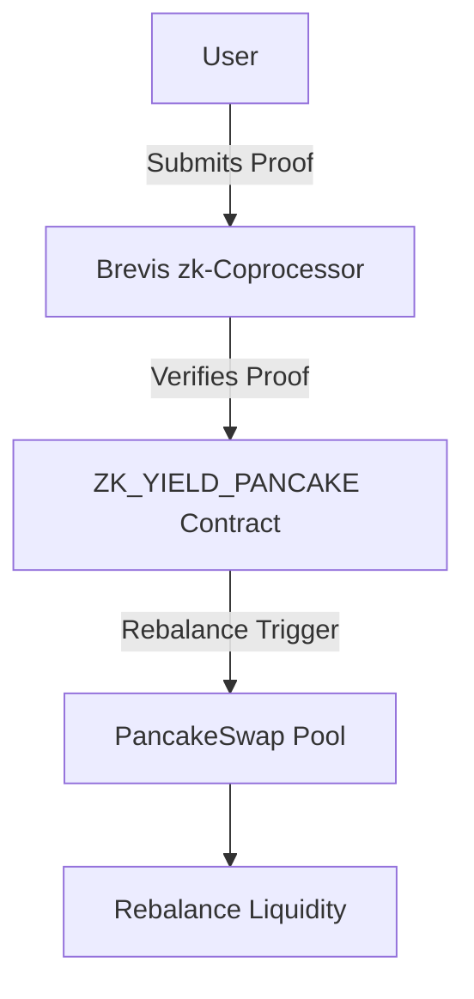

# ZK_YIELD_PANCAKE

ZK_YIELD_PANCAKE is a smart contract solution that integrates zk-SNARK proof verification using Brevis' zk-Coprocessor and PancakeSwap v4 pools. It allows rebalancing liquidity pools based on price limits and zk-SNARK proof results, ensuring secure and optimized yield management for decentralized finance (DeFi) applications.

## Key Features

- **zk-SNARK Proof Verification**: Securely verifies zk-SNARK proofs using Brevis' zk-Coprocessor, ensuring the authenticity of inputs like account age and transaction history.
- **Automated Rebalancing**: Uses PancakeSwap v4 pools and automatically rebalances pools when token prices fall below a specified threshold.
- **Efficient Yield Management**: Optimizes yield across different liquidity pools by dynamically adjusting allocations based on zk-SNARK proofs and price data.
- **Price Limit Mechanism**: Ensures that assets are reallocated when market prices breach predefined limits, protecting the yield against significant market changes.

## Architecture

The following is the architecture diagram for ZK_YIELD_PANCAKE, which includes the integration between PancakeSwap pools, the Brevis zk-Coprocessor, and zk-SNARK verification logic.



## Prerequisites

To run the ZK_YIELD_PANCAKE project, you'll need:

- Node.js & npm
- Solidity 0.8.18+
- OpenZeppelin Contracts
- Truffle or Hardhat (for contract development)
- Brevis zk-Coprocessor contracts
- PancakeSwap v4 core contracts
- A supported Ethereum-compatible network (e.g., BSC Testnet, Optimism, Base)

## Installation

1. Clone the repository from GitHub:

   ```bash
   git clone https://github.com/yourusername/ZK_YIELD_PANCAKE.git
   cd ZK_YIELD_PANCAKE
   ```

2. Install the required dependencies:

   ```bash
   npm install
   ```

3. Install PancakeSwap v4 core contracts from the cloned directory:

   ```bash
   cp -r pancake-v4-core/src/* ./contracts/
   ```

## Configuration

1. Update your `truffle-config.js` or `hardhat.config.js` file to include network configurations for deploying on your chosen test network (e.g., BSC Testnet).

   Example for `truffle-config.js`:

   ```javascript
   module.exports = {
     networks: {
       testnet: {
         provider: () => new HDWalletProvider(mnemonic, `https://data-seed-prebsc-1-s1.binance.org:8545`),
         network_id: 97,
         gas: 5000000,
         confirmations: 10,
         timeoutBlocks: 200,
         skipDryRun: true
       },
     },
     compilers: {
       solc: {
         version: "0.8.18",
       }
     }
   };
   ```

2. Set the Brevis zk-Coprocessor contract addresses and PancakeSwap factory address in the deployment file.

## Usage

### 1. Deploy the Contracts

Deploy the smart contracts to your chosen network:

```bash
truffle migrate --network testnet
```

### 2. Interact with ZK_YIELD_PANCAKE

Use a frontend (like React) or Truffle console to interact with the contract. Example:

```bash
truffle console --network testnet

// Rebalance pools
const zkYieldPancake = await ZK_YIELD_PANCAKE.deployed();
await zkYieldPancake.checkPriceLimitAndRebalance(newAllocations, proof, publicInputs);
```

## Contributing

We welcome contributions from the community! To contribute:

1. Fork the repository.
2. Create a new branch with your feature/fix: `git checkout -b feature-name`.
3. Commit your changes: `git commit -m 'Add feature name'`.
4. Push to the branch: `git push origin feature-name`.
5. Submit a pull request to the main repository.

## License

This project is licensed under the MIT License. See the [LICENSE](LICENSE) file for more details.

## Contact

For questions, feedback, or issues, feel free to reach out via:

- GitHub Issues: https://github.com/yourusername/ZK_YIELD_PANCAKE/issues
- Email: contact@yourdomain.com

## Acknowledgements

This project is built using:

- [PancakeSwap v4](https://github.com/pancakeswap)
- [Brevis zk-Coprocessor](https://brevis.link)
- [OpenZeppelin Contracts](https://openzeppelin.com/contracts)
- [Solidity](https://soliditylang.org/)

Special thanks to the contributors and maintainers of these libraries and frameworks!
